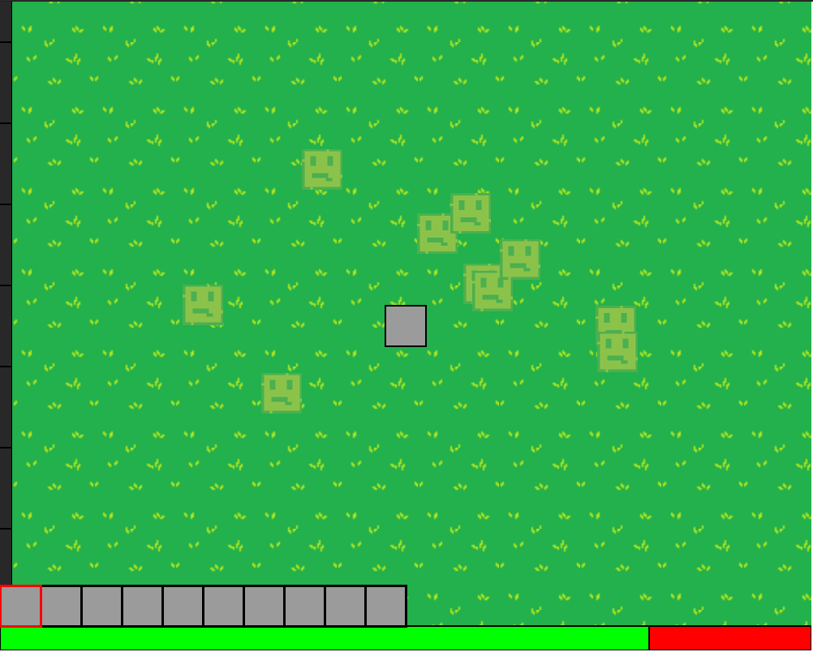

# p5game
a small proff of concept game in p5.js

all the "game engine" was coded in p5.js with no external libs, currently the game is a wave based top down fighting game, but it has code in it for block placement and other features, i plan to work in different features and different game formats while developing a basic game engine underneath

## Why? 💭

The project came as a idea to keep programming while in downtime, i needed some kind of project to work on that wasn't work or university relates. The idea of a game was always in my mind, because it gave the oportunity to try a number of different ideas and game mechanics. The project is all made in JS by choice, altough i know all the limitations it will impose me, i wanted to see what i could do with one of my favorite programming languages and with no external games lib

## What's next? ➡️

Here are some of the things in my todo list with the project:

- [ ] polish up the "waves" mode
- [ ] add more itens and more mobs 
- [ ] add ranged weapons
- [ ] make the "game engine" more indenpendent of the game style
- [ ] take out most of the uses of global variables 💩💩💩
- [ ] start working on other game modes

## future goals? 🗓️

Here are some of the things i wished the project could do some day but not right now:

- [ ] multiplayer support (socket.io maybe)
- [ ] economy system

## deadly bugs?  🐛

while trying to make the game my focus qas to try to create something that worked and didn't made me want to quick halfway, but with that a lot of bugs were createed, and most of them i can't figure out how to solve:

- [ ] variable size of screen (with any size of the display screen the game should recalculate and work fine) 
- [ ] variable block sizes (some freaky things happen with collision currently)
- [X] some good kind of melee colision (at the moment i use a circle hit box, because it was the one i got working 😂😂😂)

# gallery 

normal mode:

debug mode (acessed with ´p´)

# how to "download" ?

1- clone or download de the repo

2- open it with vscode

3- install vscode plugin liveserver

4- click start live server

# how to play ?

you will start with nothing, in the map there's gold (useless at the moment) and a single stick, altough the stick does very little damage it's enough to kill the slimes, the slimes may drop better weapons after a wave is cleared another one will spawn in 2 seconds

# thank you:

if you stumbled in this project i would really apreciate it if you gave it a try and gave me any feedback, have fun =)
